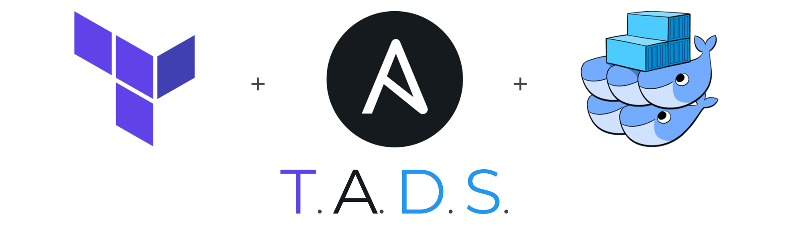

# T.A.D.S. boilerplate <!-- omit in toc -->

[](https://travis-ci.com/Thomvaill/tads-boilerplate)
[](https://opensource.org/licenses/MIT)
[](https://twitter.com/intent/tweet?text=Get%20started%20with%20Infrastructure%20as%20Code%20with%20T.A.D.S.%20https%3A%2F%2Fgithub.com%2FThomvaill%2Ftads-boilerplate%20-%20A%20boilerplate%20created%20by%20%40thomvaill%20which%20combines%20%23Terraform%20%23Ansible%20%23Vagrant%20and%20%23DockerSwarm.%20%23Docker%20%23DevOps%20%23IaC)

<div align="center"><strong>The power of Ansible and Terraform + the simplicity of Swarm = DevOps on :fire::fire::fire:</strong></div>
<br />



- [:tada: What is it?](#tada-what-is-it)
- [:dart: Who is it for?](#dart-who-is-it-for)
- [:muscle: Philosophy](#muscle-philosophy)
- [:lock: Knowledge prerequisites](#lock-knowledge-prerequisites)
- [:lock: Technical prerequisites](#lock-technical-prerequisites)
- [:rocket: Quick start](#rocket-quick-start)
  - [1. Make this repository yours](#1-make-this-repository-yours)
  - [2. Install the required dependencies](#2-install-the-required-dependencies)
  - [3. Provision your local machine and deploy the example stack](#3-provision-your-local-machine-and-deploy-the-example-stack)
  - [4. Write your own Docker Swarm Compose files](#4-write-your-own-docker-swarm-compose-files)
  - [5. Test on a Vagrant cluster](#5-test-on-a-vagrant-cluster)
  - [6. Edit and encrypt your production environment variables](#6-edit-and-encrypt-your-production-environment-variables)
  - [7.a. Create, provision and deploy your production environment with Terraform](#7a-create-provision-and-deploy-your-production-environment-with-terraform)
  - [7.b. Provision and deploy your production environment to an existing infrastructure](#7b-provision-and-deploy-your-production-environment-to-an-existing-infrastructure)
  - [8. Add other remote environments](#8-add-other-remote-environments)
  - [9. Make your team members autonomous](#9-make-your-team-members-autonomous)
- [:question: FAQ](#question-faq)
- [Contributing](#contributing)
- [Acknowledgments](#acknowledgments)
- [License](#license)

## :tada: What is it?

A boilerplate to create a full Infrastructure as Code (IaC) repository, from provisioning to deployment with:

- **Terraform** to create your cloud infrastructure
- **Vagrant** to reproduce a production-like environment locally
- **Ansible** to provision Virtual Machines and set up the **Docker Swarm** cluster
- **Ansible** again to deploy your stacks

It handles different environments:

- `localhost`: a single node Docker Swarm cluster on your machine, useful for development ([demo](https://asciinema.org/a/282625))
- `vagrant`: a 3 nodes production-like cluster deployed with Vagrant on your machine, useful for testing ([demo](https://asciinema.org/a/282636))
- `production`: your production environment! It can be created by Terraform or you can use an existing bare metal/VMs infrastructure ([demo](https://asciinema.org/a/282640))
- other remote production-like environments of your choice: staging, QA...

On top of that, it features:

- A companion CLI (`./tads`), which is a wrapper around Terraform, Ansible and Vagrant commands. For example: `ansible-playbook -i inventories/production -D --vault-id production@vault_keys/production deploy.yml` becomes `./tads ansible-playbook production deploy`. More convenient, don't you think? :smirk:
- Docker Swarm Compose files templated with Jinja2, so you can define your services once, while being able to customize them in each environment, from the same file
- An example which implements [dockerswarm.rocks' recommended good practices](https://dockerswarm.rocks/): traefik reverse proxy with HTTPS (even locally), and more coming soon
- A smart `/etc/hosts` management to access your local and Vagrant applications with `.localhost` and `.test` https URIs
- AES-256 encryption of your production credentials with ansible-vault

With T.A.D.S., you will be able to onboard a new developer on your project in less than 3 minutes, with just 3 commands! Even if you have a complex microservices architecture. Forget about your outdated wikis or installation procedures, they are no longer needed! See the [example user README](README.example.md) to get a preview of what your new procedures could look like.

[](https://asciinema.org/a/282625)
<div align="center"><sub>Example of a fresh development environment setup with T.A.D.S. in 02:30!</sub></div>

## :dart: Who is it for?

If you recognize yourself into some of these statements, this project is definitely for you:

- I am the only one who understands how the production environment works
- I still have to execute SSH commands in production and this makes me sad because I cannot rollback or be reviewed :(
- Setting up a new development environment for a new team member takes an entire day, and a lot of resources
- My team suffers from "Microservices Hell": we have to install many services before being able to dev
- Developers use docker-compose on their machine, while we use something else in production
- I want to do Infrastructure as Code (IaC)
- I want to promote the DevOps mindset in my team
- I don't need/want Kubernetes features and complexity
- I don't want to be vendor locked by a service like AWS ECS
- I start a new project and I want to bootstrap it quickly with good practices presets

On the contrary, this project might not be for you if:

- You have a large cluster (more than 100 machines)
- You need Kubernetes features like autoscaling

... but don't be sad, I am thinking of creating a similar project for K8s ;) Tell me if you want to help!

## :muscle: Philosophy

- Every environment infrastructure, including dev, is versioned into one repository
- Same development environment installation procedure for everyone
- No SSH, no manual actions, everything must be code
- Every change to infrastructure must be code reviewed to:
  - Avoid mistakes
  - Make other (including non-DevOps) team members able to learn
- Everyone, not only DevOps team members, is able to:
  - Create their development environment in a minute with just one command
  - Reproduce a production-like environment locally
  - Understand the whole infrastructure
  - Propose modifications to the infrastructure, while being able to test them locally
- This project is a boilerplate, not a framework: modify it to fulfill your needs!
- The companion CLI is written in Bash so it is easy to understand what a command does, and it is easy to modify command behaviors or to add new ones

## :lock: Knowledge prerequisites

Before going further, I assume that you already have the knowledge **and practice** with Docker Swarm mode, Ansible, Terraform, and Infrastructure as Code in general.
If it is not the case, I urge you to study and practice **before**. You can use this material as a starter:

- [Getting started with swarm mode](https://docs.docker.com/engine/swarm/swarm-tutorial/) and [Docker Swarm Rocks](https://dockerswarm.rocks/)
- [Ansible Quickstart guide](https://docs.ansible.com/ansible/latest/user_guide/quickstart.html)
- [Terraform getting started](https://learn.hashicorp.com/terraform/getting-started/install.html)

## :lock: Technical prerequisites

- **Local machine**:
  - Ubuntu >= 18.04 or similar (PRs are welcome to update this list)
  - Ansible >= 2.8
  - Vagrant >= 2.0 *(optional)*
  - Virtualbox >= 5.2 *(optional)*
  - Terraform >= 0.12 *(optional)*
- **Remote environments**:
  - A cloud provider account (tested on AWS and Digital Ocean so far)
  - ***OR***
  - An existing bare metal / VMs infrastructure, with Linux based OSes (tested on Ubuntu server 18.04 and Debian 9 so far)

Have a look at [Install the required dependencies](#2-install-the-required-dependencies) for installation procedures.

**OS X:** It should not be that hard to make the project run on OS X. PRs are welcome! I am also thinking of creating a dockerized version of the project to improve compatibility.

## :rocket: Quick start

### 1. Make this repository yours

Clone this repo, create your own and push the code to it.

```bash
git clone --single-branch https://github.com/Thomvaill/tads-boilerplate.git <YOUR_PROJECT_NAME>
cd <YOUR_PROJECT_NAME>
git remote set-url origin <YOUR_REPO_URL>
git push
```

### 2. Install the required dependencies

This will install Ansible, Vagrant, Virtualbox and Terraform on your local machine:

```bash
./tads install-dependencies
```

You can also manually install the dependencies if your preferer.

### 3. Provision your local machine and deploy the example stack

1. Copy `ansible/group_vars/localhost_overrides.sample.yml` to `ansible/group_vars/localhost_overrides.yml`  
2. Add `ansible_user` variable with your user name

```raw
ansible_user: <yourUserName>
```

3. Provision and Deploy

```bash
./tads ansible-playbook localhost provision
./tads ansible-playbook localhost deploy
```

The first `./tads` command will:

- Install Docker on your local machine
- Set up a Swarm cluster with one manager node
- Hardcode `yourcompany.localhost` to your `/etc/hosts` file

And the second one will deploy `traefik` and `example_app` stacks.
If everything went well, you are now able to access it at this URL: https://yourcompany.localhost/

### 4. Write your own Docker Swarm Compose files

Now that the example stack is running on your machine, you can deploy your own services.

First, you probably need to change the `domains` dict in `ansible/group_vars/all.yml`.
This file contains all Ansible variables default values. These values can be overridden later in other group_vars files.
You are free to add your variables in it.

Then, you can write your own Docker Swarm Compose files, following this naming convention: `ansible/stacks/<STACK_NAME>/<STACK_NAME>.yml.j2`
These files are [Jinja2 templates](https://docs.ansible.com/ansible/latest/user_guide/playbooks_templating.html).
You are highly encouraged to use Ansible variables in them, so your template file can be used across all your environments.
Have a look at `ansible/stacks/example_app/example_app.yml.j2` to see a good example.

Finally, do not forget to add your new stacks to `ansible/deploy.yml`.

To help you with the `ansible/group_vars` directory, here is a representation of Ansible groups:

```raw
all
├── dev
|   ├── localhost
|   └── vagrant
├── production
├── staging
└── any_other_remote_environment...
```

Each group has its `_overrides` counterpart, which enables you to override some variables locally in a `xxx_overrides.yml` file,
which is not versionned.
Have a look at `.sample.yml` files to see some examples.

While developing, perform some `./tads ansible-playbook localhost deploy` to test your deployment.
Do not forget to run `./tads ansible-playbook localhost provision` again if you have changed domain names.

**Tips:**

- You can use `./tads ansible-playbook localhost all` to provision and deploy in a single command
- You can use tags to go quicker. Example: `./tads ansible-playbook localhost all --tags dev,stack-traefik`
- Always reference your Docker images with tags! It is a bad practice to rely on the `:latest` tag because you don't control what will be pushed to production. With specific tags, you will have idempotent deployments and you will be able to perform rollbacks

### 5. Test on a Vagrant cluster

Now that you are happy with your localhost environment, you should test the provisioning and the deployment
on an environment which looks more like a production environment.
For instance, on localhost, you can have just one node! And maybe you forgot some dependencies that are already installed on your computer.
With Vagrant, you will be able to test your stacks on a fresh 3 nodes Swarm cluster.

1. Copy `vagrant/vagrant.sample.yml` to `vagrant/vagrant.yml` and adjust its settings
2. Run `./tads vagrant up`
3. Run `./tads ansible-playbook vagrant all`

Now, you will be able to test your stacks deployed on Vagrant. If you have kept the example app, you can test it on https://yourcompany.test/

**Tips:**

- To destroy your cluster: `./tads vagrant destroy`
- To SSH into the first node: `./tads vagrant ssh vagrant-1`
  
### 6. Edit and encrypt your production environment variables

Before going further, you should edit your production group_vars files:

- `ansible/group_vars/production.yml`
- `ansible/group_vars/production_encrypted.yml`
  
When you are done, **do not commit `production_encrypted.yml`**! You have to encrypt it first:

- `./tads ansible-vault production init-key`
- `./tads ansible-vault production encrypt ansible/group_vars/production_encrypted.yml`

The first command has generated a random key in `ansible/vault_keys/production`.
You must not commit this file. You should keep it in a safe place, and share it with your authorized team members securely.
If you lose it, you won't be able to decrypt your files anymore. The second one has encrypted your file
with AES-256. You can now commit it.

You can still edit this file by running `./tads ansible-vault production edit ansible/group_vars/production_encrypted.yml`. Always check that you do not commit an unencrypted version of this file by mistake.

### 7.a. Create, provision and deploy your production environment with Terraform

Now that everything is fine locally, it is time to create and deploy your production environment!

The `terraform/environments/production` is an AWS example. PRs are welcome for other providers!
To make it work, you should:

- Have a working SSH key pair
- Have a registered domain name managed by Route53
- [Install AWS CLI](https://docs.aws.amazon.com/fr_fr/cli/latest/userguide/cli-chap-install.html): `pip3 install awscli --upgrade --user`
- Configure your credentials: `aws configure`

Terraform will use this default profile credentials.

Then, you can run `./tads terraform production init` and `./tads terraform production apply`.
This example will create:

- A custom VPC
- 3 subnets into separate Availability Zones, for high availability
- 3 manager nodes and 1 worker node (with spread placement groups, for high availability)
- 1 classic ELB to distribute TCP traffic on port 80 and 443 to the manager nodes (traefik is responsible for SSL termination)

The CLI will also create the corresponding Ansible inventory for you in `ansible/inventories/production` from Terraform outputs. You should commit it.
You should also commit the Terraform state file, or better: [use a remote state](https://www.terraform.io/docs/state/remote.html).

Then, you have to [create an alias in Route53 to the ELB](https://docs.aws.amazon.com/Route53/latest/DeveloperGuide/routing-to-elb-load-balancer.html).

Finally, you can run `./tads ansible-playbook production all` and your website will be available!

**Disclaimer:**

- This is an example, you should not use it as is in production!
- Although resources created by the example are eligible to free tier, charges may occur depending on your situation
- Use `./tads terraform production destroy` with caution :-)

### 7.b. Provision and deploy your production environment to an existing infrastructure

If you don't want to use a cloud provider, you can use classic Virtual Machines.
For a production environment, you should have at least 3 manager nodes, so 3 VMs.
They should be fresh installs. Ubuntu server 18.04 or Debian 9 is fine.

1. Make sure you can SSH into the VMs with your key pair
2. Copy `ansible/inventories/production.sample-baremetal` to `ansible/inventories/production`
3. Edit it
4. Run `./tads ansible-playbook production all` and your website will be available!

### 8. Add other remote environments

You can add other remote environments, like production.

For Terraform, you just have to duplicate `terraform/environments/production` to the directory of your choice, eg `staging`.
After editing it, you can run `./tads terraform staging apply`, it will create the `ansible/inventories/staging` inventory file.

For an existing bare metal infrastructure, you just have to create the `ansible/inventories/staging` inventory file.

Then, in Ansible, you have to create these files:

- `ansible/group_vars/staging_encrypted.yml`
- `ansible/group_vars/staging.yml`

Then, create the ansible-vault key and encrypt the file:

- `./tads ansible-vault staging init-key`
- `./tads ansible-vault staging encrypt ansible/group_vars/staging_encrypted.yml`

Finally, provision and deploy! `./tads ansible-playbook staging all`

### 9. Make your team members autonomous

It is one of this project's goals: DevOps is not a job, it is a mindset!
Now that you have a beautiful IaC, it is time to onboard your team members.

1. Replace this `README.md` by `README.example.md` and customize it, so your team can use the project easily
2. Make your developers use this project to configure their machine and develop
3. Let your developers update/create stacks on their own, show them how to test their changes locally
4. Enjoy :-)

## :question: FAQ

### Where is the companion CLI documentation? <!-- omit in toc -->

There is no documentation of the CLI since you will probably modify it, or add new commands!
To get some help, just run `./tads`. Do not hesitate also to have a look at the source into the `scripts` directory. This CLI is just a wrapper of Terraform, Ansible and Vagrant commands.

### What if I don't want to deploy all the stacks locally? <!-- omit in toc -->

Use Ansible tags! Example if you just want to deploy the `traefik` and `myapp` stack: `./tads ansible-playbook localhost deploy --tags stack-traefik,stack-myapp`.

### How to do Continuous Delivery / Deployment? <!-- omit in toc -->

I have not taken the time to develop this feature properly yet. But basically what you can do is:

- Always referer to your Docker images with tags
- Manage those tags into a separate `tags.yml` file
- Write a script that can update a tag, perform a `./tads ansible-playbook production deploy`, and in case of success commit and push the file
- Make your CI/CD tool use this script in your deployment pipeline

### How to manage persistant storage? <!-- omit in toc -->

This problematic is beyond the scope of this project and depends a lot on your infrastructure / cloud provider.
I advise you to have a look at [REX-Ray](https://github.com/rexray/rexray).

This might be a future feature to implement this plugin in the boilerplate.

## Contributing

Pull Requests are more than welcome! Please read [CONTRIBUTING.md](CONTRIBUTING.md) for more details.

Development:

```bash
./tads install-dependencies --dev
make lint
make test
```

## Acknowledgments

- John Patterson for his [ansible-swarm-playbook](https://github.com/nextrevision/ansible-swarm-playbook) and his [article](https://thisendout.com/2016/09/13/deploying-docker-swarm-with-ansible/)
- Jeff Geerling for his [pip](https://github.com/geerlingguy/ansible-role-pip) and [docker](https://github.com/geerlingguy/ansible-role-docker) Ansible roles
- The [forMetris](https://github.com/forMetris) team for being first users/testers of the project, and especially Axel Marbois for his contribution

## License

This project is licensed under the MIT license, Copyright (c) 2019 Thomas Vaillant. For more information see [LICENSE](LICENSE) file.
